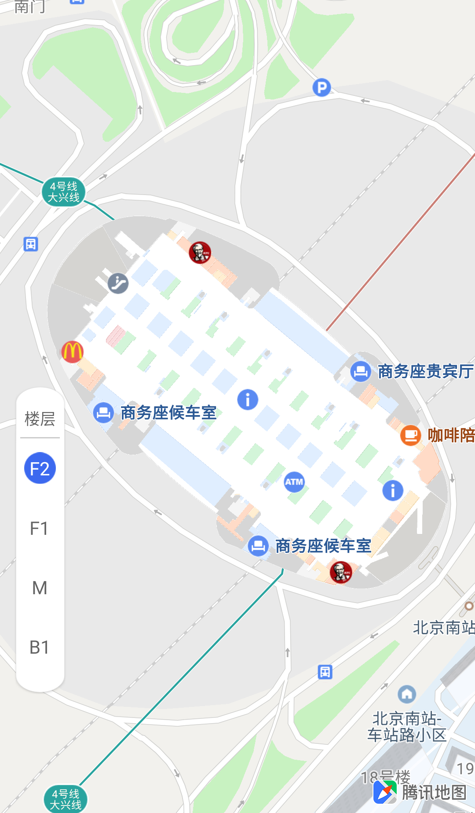
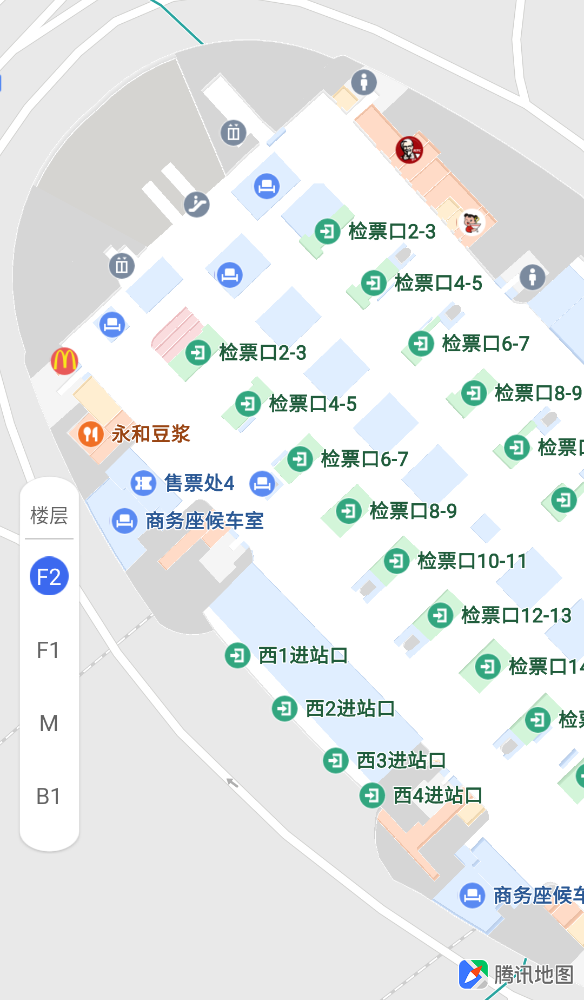

[TOC]

# 介绍 #

腾讯地图SDK（Android）是一套基于Android 2.3及以上设备的应用程序接口。通过该接口，您可以轻松访问腾讯地图服务和数据，构建功能丰富、交互性强的地图应用程序。

地图SDK：提供地图的展示、标注、绘制图形等功能。

API是提供给那些具有一定Android编程经验和了解面向对象概念的读者使用。此外，读者还应该对地图产品有一定的了解。您在使用中遇到任何问题，都可以及时向我们反馈。

<span style="color:red">地图作为一个 UI 控件，用户对地图所有接口的调用都应从主线程调用，请重点关注！！！</span>

# 配置 #
## 工程配置 ##

这里我们提供Android Studio的腾讯地图SDK的工程配置方法。

**Android Studio**

解压下载的压缩包，将*"*.aar"拷贝到app/libs/文件夹下。 然后在module的build.gradle里修改dependencies，添加如下代码，rebuild一下即可。

```properties
implementation fileTree(dir: 'libs', include: ['*.jar','*aar'])
```

地图SDK需要使用网络，访问硬件存储等系统权限，在AndroidManifest.xml文件里，添加如下权限：

```xml
<!--腾讯地图 SDK 要求的权限(开始)-->
<!--访问网络获取地图服务-->
<uses-permission android:name="android.permission.INTERNET"/>
<!--检查网络可用性-->
<uses-permission android:name="android.permission.ACCESS_NETWORK_STATE"/>
<!-- 访问WiFi状态 -->
<uses-permission android:name="android.permission.ACCESS_WIFI_STATE" />
<!--需要外部存储写权限用于保存地图缓存-->
<uses-permission android:name="android.permission.WRITE_EXTERNAL_STORAGE"/>
<!--获取 device id 辨别设备-->
<uses-permission android:name="android.permission.READ_PHONE_STATE"/>
<!--腾讯地图 SDK 要求的权限(结束)-->
```

## key配置 ##

要正常使用腾讯地图SDK用户需要在[https://lbs.qq.com/console/key.html](https://lbs.qq.com/console/key.html)申请开发密钥，申请开发密钥是免费的，腾讯地图SDK的使用也是免费的。

开发者申请key后，把Key输入工程的AndroidManifest.xml文件中，在application节点里，添加名称为TencentMapSDK的meta，如下所示(value值为申请的key)：

```xml
<application
	<meta-data
        android:name="TencentMapSDK"
        android:value="*****-*****-*****-*****-*****-*****"/>
</application>
```


## 混淆配置 ##

如果需要混淆您的工程，请在module里找到proguard-rules.pro文件，添加如下混淆脚本：

```properties
-keep class com.tencent.tencentmap.**{*;}
-keep class com.tencent.map.**{*;}
-keep class com.tencent.beacontmap.**{*;}
-keep class navsns.**{*;}
-dontwarn com.qq.**
-dontwarn com.tencent.**
```

# 地图显示 #

## 地图实例化 ##

 腾讯地图SDK提供了两种展示地图的实现方式 —— MapView和SupportMapFragment。

**方法一：MapView**

一个显示地图的视图（View），它负责从服务端获取地图数据，负责捕捉屏幕触控手势事件。使用这个类必须按照它的生命周期进行操控，你必须参照以下方法onCreate(Bundle)、onStart()、onResume()、onPause()、onStop()、onDestroy()等声明周期函数。

用MapView加载地图的方法就像Android 提供的其他View一样，具体的使用步骤如下：

步骤1：对需要加载地图的Acticity相应的*.xml文件中添加代码，以MainActicity为例，在activity_main.xml中添加如下代码：

```xml
<com.tencent.tencentmap.mapsdk.maps.MapView
	android:id="@+id/map"
	android:layout_width="match_parent"
	android:layout_height="match_parent" />
```

步骤2：在需要加载地图的Acticity中添加如下代码，其中包括地图对象的实例化，由于SDK并没有提供用于管理地图生命周期的Activity，因此需要用户继承Activity后管理地图的生命周期，防止内存泄露。以MainActicity为例，示例代码如下：

```java
public class MainActivity extends Activity {

private MapView mapView;
private TencentMap tencentMap;

@Override
protected void onCreate(Bundle savedInstanceState) {
    super.onCreate(savedInstanceState);
    setContentView(R.layout.activity_main);

    mapView = (MapView)findViewById(R.id.map_view);
    tencentMap = mapView.getMap();
}

@Override
protected void onStart() {
    // TODO Auto-generated method stub
    super.onStart();
    mapView.onStart();
}

@Override
protected void onResume() {
    // TODO Auto-generated method stub
    super.onResume();
    mapView.onResume();
}

@Override
protected void onPause() {
    // TODO Auto-generated method stub
    super.onPause();
    mapView.onPause();
}

@Override
protected void onStop() {
    // TODO Auto-generated method stub
    super.onStop();
    mapView.onStop();
}

@Override
protected void onRestart() {
    // TODO Auto-generated method stub
    super.onRestart();
    mapView.onRestart();
}

@Override
protected void onDestroy() {
    // TODO Auto-generated method stub
    super.onDestroy();
    mapView.onDestroy();
}
}
```

**方法二：SupportMapFragment**

SDK还提供了SupportMapFragment这个类来加载地图，这个类的方便之处就在于不用手动管理内存了，而且还具有Fragment灵活布局的优点，更推荐大家使用SupportMapFragment加载地图。这里简单说明一下SupportMapFragment的使用方法。

步骤1：在activity_main.xml中添加如下代码：

```xml
<fragment
    android:id="@+id/map_frag"
    android:layout_width="match_parent"
    android:layout_height="match_parent"
class="com.tencent.tencentmap.mapsdk.maps.SupportMapFragment"/>
```

步骤2：在需要加载地图的Acticity中实例化地图对象，该Acitvity需要继承FragmentAcitivity来管理SupportMapFragment。以MainActicity为例，示例代码如下：

```java
public class MainActivity extends FragmentActivity {

private TencentMap tencentMap;

@Override
protected void onCreate(Bundle savedInstanceState) {
    // TODO Auto-generated method stub
    super.onCreate(savedInstanceState);
    setContentView(R.layout.activity_main);

    FragmentManager fm = getSupportFragmentManager();
    SupportMapFragment mapFragment = (SupportMapFragment)fm.findFragmentById(R.id.map_frag);
    tencentMap = mapFragment.getMap();
}
}
```

运行工程就可以在您的APP中看到腾讯地图了，效果如下图所示：


## 设置地图类型 ##

腾讯地图SDK提供5种类型的基本地图，具体如下：

地图样式（styleType） | 说明 
- | :-: 
MAP_TYPE_NONE  		| 空白地图
MAP_TYPE_NORMAL  	| 普通地图
MAP_TYPE_SATELLITE  | 卫星图
MAP_TYPE_NAVI	    | 导航模式
MAP_TYPE_NIGHT      | 夜间模式 

1、普通地图与实时路况：

普通地图的信息包括路网信息、建筑物及重要的自然景观；腾讯地图还提供了实时路况图层，可以为提供实时交通数据的城市展示实时交通状况，设置显示普通地图和实时路况的示代码如下：

```java
tencentMap.setMapStyle(TencentMap.MAP_TYPE_NORMAL); //显示普通地图
tencentMap.setTrafficEnabled(true); //参数为true表示开启实时路况，参数为false表示关闭
```

2、卫星图：

卫星地图有两种设置方式，代码如下：

```java
tencentMap.setSatelliteEnabled(true); //开启卫星图
或
tencentMap.setMapStyle(TencentMap.MAP_TYPE_SATELLITE); //直接设置卫星地图
```

实时路况和卫星图的效果如下所示：

  

# 地图视野操作 #

地图视野操作主要包括地图的缩放、移动、旋转、倾斜、改变地图中心点等操作，以动画的方式把地图变换到指定的状态。CameraUpdateFactory提供13种方法执行地图视野操作。

可以通过TencentMap的animateCamera()方法以动画的方式把地图变换到指定的状态，也可以通过TencentMap的moveCamera()方法直接把地图变换到指定的状态；TencentMap的stopAnimation可以停止地图所有正在进行的动画。具体如下：

```java
//以动画的方式把地图变换到指定的状态
tencentMap.animateCamera(CameraUpdate cameraupdate);

tencentMap.animateCamera(CameraUpdate cameraupdate, CancelableCallback cancelablecallback);

tencentMap.animateCamera(CameraUpdate cameraupdate, long duration,
        CancelableCallback cancelablecallback);

//直接把地图变换到指定的状态
tencentMap.moveCamera(CameraUpdate cameraupdate);

//停止地图所有正在进行的动画
tencentMap.stopAnimation();

参数：
cameraupdate：状态对象
duration：动画执行时间（单位：ms）
cancelablecallback：动画状态监听器
```

## 改变地图视野 ##

由CameraPosition生成地图状态对象，直接改变地图视野。

注意：腾讯地图SDK使用的是国测局坐标系（火星坐标，GCJ-02）。

直接把地图变化到指定状态的示例代码如下：

```java
CameraUpdate cameraSigma =
    CameraUpdateFactory.newCameraPosition(new CameraPosition(
        new LatLng(39.977290,116.337000), //中心点坐标，地图目标经纬度
        19,  //目标缩放级别
        45f, //目标倾斜角[0.0 ~ 45.0] (垂直地图时为0)
        45f)); //目标旋转角 0~360° (正北方为0)
tencentMap.moveCamera(cameraSigma); //移动地图
```

效果如下图所示：


## 地图移动##

CameraUpdateFactory中提供scrollBy()方法平移地图，newLatLng()方法改变地图中心点、移动地图，如下所示：

```java
tencentMap.animateCamera(CameraUpdateFactory.scrollBy(float xPixel, float yPixel)); //将地图向左下移动xPixel和yPexil像素，xPixel为向左移动的像素，yPixel为向下移动的像素

tencentMap.animateCamera(CameraUpdateFactory.newLatLng(LatLng latlng)); //把地图移动指定的经纬度到屏幕中心，latlng为目标经纬度

tencentMap.animateCamera(CameraUpdateFactory.newLatLng(LatLng latlng, float zoom)); //把地图以latlng为中心，以zoom为缩放级别，移到屏幕中心；latlng为目标经纬度，zoom为新的指定级别，取值范围为 [3.0 ~ 19.0]
```

把地图移动到指定的经纬度范围，具体应用参见“地图标注”部分：

```java
tencentMap.animateCamera(CameraUpdateFactory.newLatLngBounds(LatLngBounds latlngbounds,
		int padding)); //把地图移到到以指定的经纬度范围的，并且在这个范围四周加上padding像素的填充；latLngBounds为经纬度范围，padding为四周填充的像素

tencentMap.animateCamera(CameraUpdateFactory.newLatLngBoundsRect(LatLngBounds latlngbounds,
		int leftPadding, int rightPadding, int topPadding, int bottomPadding)); //把地图移动到指定经纬度范围，以适应当前屏幕的显示，并且可以为上下左右分别设置填充的像素；参数分别为经纬度范围、左侧填充像素、右侧填充像素、右侧填充像素、 顶部填充像素、底部填充像素

tencentMap.animateCamera(CameraUpdateFactory.newElementBoundsRect(List<IMapElement> elements, int leftPadding, int rightPadding, int topPadding, int bottomPadding)); //把地图移动到指定元素所在范围，以适应当前屏幕的显示，并且可以为上下左右分别设置填充的像素.

参数：
latLngBounds 经纬度范围（指定西南和东北的坐标点）
padding 四周填充的像素
leftPadding 左侧填充像素
rightPadding 右侧填充像素
topPadding 顶部填充像素
bottomPadding 底部填充像素
elements 要显示在底图上的元素
```

## 地图缩放 ##

CameraUpdateFactory中提供zoomIn()、zoomOut()、zoomTo()、zoomBy()等方法可以改变地图的缩放级别。

设置方法为：

```java
tencentMap.animateCamera(CameraUpdateFactory.zoomIn()); //把地图放大一级

tencentMap.animateCamera(CameraUpdateFactory.zoomOut()); //把地图缩小一级

tencentMap.animateCamera(CameraUpdateFactory.zoomTo(float zoomLevel)); //把地图缩放到目标级别zoomLevel，取值范围为 [4.0 ~ 20.0]

tencentMap.animateCamera(CameraUpdateFactory.zoomBy(float zoomLevelDelta)); //在当前的缩放级别下，把缩放级别变化zoomLevelDelta，如果超出了范围，则停止在范围内

tencentMap.animateCamera(CameraUpdateFactory.zoomBy(float zoomLevelDelta, Point point)); //在当前的缩放级别下，把缩放级别变化zoomLevelDelta，如果超出了范围，则停止在范围内；zoomLevelDelta为要变化的级别数值，point为当前地图所处的地图点，移动后屏幕处于中心点
```

## 地图旋转、倾斜 ##

设置方法为：

```java
tencentMap.animateCamera(CameraUpdateFactory.rotateTo(float rotate, float skew)); //将地图顺时针旋转rotate度，并且向后倾斜skew度
```

## 设置视野变换的中心点 ##

设置方法为：

```java
tencentMap.setCameraCenterProportion(float xratio, float yratio); //设置camera变换的中心点
或：
tencentMap.setCameraCenterProportion(float xratio, float yratio, boolean moveMap);

参数：
xratio 水平方向位置
yratio 垂直方向位置
moveMap 改变中心点的同时是否将原有中心点移到新的中心点
```

## 设置地图的缩放级别 ##

```java
tencentMap.setMaxZoomLevel(int zoomLevel); //设置地图的最大缩放级别  （3~19）

tencentMap.setMinZoomLevel(int zoomLevel); //设置地图的最小缩放级别
```

## 地图视野变换监听 ##

```java
//设置地图视野变换的监听接口
tencentMap.setOnCameraChangeListener(new TencentMap.OnCameraChangeListener() {
        @Override
        public void onCameraChange(CameraPosition cameraPosition) {
            
        }

        @Override
        public void onCameraChangeFinished(CameraPosition cameraPosition) {

        }
    });
```

# UI设置 #

腾讯地图提供了UiSettings类以方便开发者对地图手势及SDK提供的控件的控制，以定制自己想要的视图效果。UiSettings类的实例化也是通过TencentMap来获取：

```java
UiSettings mUiSettings = tencentMap.getUiSettings(); //获取地图界面操作对象
```

## 控件设置 ##

- 缩放按钮

可以控制地图的缩放级别，每次点击改变1个级别，开启后此控件显示在右下角，设置方式及效果图如下所示：

```java
mUiSettings.setZoomControlsEnabled(boolean flag); //设置是否显示缩放按钮，true表示显示，false表示不显示

mUiSettings.isZoomControlsEnabled(); //获取当前是否显示缩放控件
```


- 指南针

可以指示地图的南北方向，默认的视图状态下不显示，只有在地图的偏航角或俯仰角不为0时才会显示，并且该控件的默认点击事件会将地图视图的俯仰角和偏航角动画到0的位置。此控件显示在左上角，设置方式及效果图如下所示：

```java
mUiSettings.setCompassEnabled(boolean flag); //设置是否显示罗盘

mUiSettings.isCompassEnabled(); //获取当前是否开启罗盘控件

//地图罗盘点击事件
mUiSettings.setCompassEnabled(true);//设置是否显示罗盘
    tencentMap.setOnCompassClickedListener(new TencentMap.OnCompassClickedListener() {
        @Override
        public void onCompassClicked() {

        }
    });
```


罗盘的填边设置请参考“接口文档”。

- 定位控件

当通过TencentMap.setLocationSource(locationSource)设置好地图的定位源后，点击此按钮可以在地图上标注一个蓝点指示用户的当前位置。定位控件显示在右下角，设置方式和效果图如下所示：

```java
mUiSettings.setMyLocationButtonEnabled(boolean flag); //设置是否显示定位按钮

mUiSettings.isMyLocationButtonEnabled(); //获取当前是否显示定位控件
```


- 比例尺控件

默认显示在左下角，也可以通过参数进行设置，设置方式和效果图如下所示：

```java
mUiSettings.setScaleViewEnabled(true); //设置当前是否显示比例尺

mUiSettings.isScaleViewEnabled(); //获取当前是否显示比例尺

mUiSettings.setScaleViewPosition(int position); //设置比例尺的显示位置

参数position：
 TencentMapOptions.SCALEVIEW_POSITION_BOTTOM_CENTER
 TencentMapOptions.SCALEVIEW_POSITION_BOTTOM_LEFT
 TencentMapOptions.SCALEVIEW_POSITION_BOTTOM_RIGHT
 TencentMapOptions.SCALEVIEW_POSITION_TOP_CENTER
 TencentMapOptions.SCALEVIEW_POSITION_TOP_LEFT
 TencentMapOptions.SCALEVIEW_POSITION_TOP_RIGHT
```


- 地图Logo

腾讯地图logo默认显示在右下角，改变Logo位置的示例代码如下：

```java
mUiSettings.setLogoPosition(int logoAnchor); //设置Logo的显示位置

参数logoAnchor：
TencentMapOptions.LOGO_POSITION_BOTTOM_CENTER
TencentMapOptions.LOGO_POSITION_BOTTOM_LEFT
TencentMapOptions.LOGO_POSITION_BOTTOM_RIGHT
TencentMapOptions.LOGO_POSITION_TOP_CENTER
TencentMapOptions.LOGO_POSITION_TOP_LEFT
TencentMapOptions.LOGO_POSITION_TOP_RIGHT
```


注意：使用腾讯地图SDK要求显示logo，如上图所示。如有特殊需求可通过setLogoPositionWithMargin方法设置偏移，示例代码如下：

```java
mUiSettings.setLogoPositionWithMargin(int position, int top, int bottom, int left, int right); //设置Logo的显示位置，带偏移量，单位像素

参数：
position 地图logo显示位置，选项同上
top      position为TOP时，该值生效，不需要偏移请传0或负数
bottom   position为BOTTOM时，该值生效，不需要偏移请传0或负数
left     position为LEFT时，该值生效，不需要偏移请传0或负数
right    position为RIGHT时，该值生效，不需要偏移请传0或负数
```

或：

```java
mUiSettings.setLogoPosition(int logoAnchor , int[] marginParams); //根据地图四个Anchor 模式（左上、左下、右下、右上）以及相应的Margins来设置Logo位置

说明：
1、若logoAnchor为 TencentMapOptions.LOGO_POSITION_BOTTOM_LEFT,则Logo的 bottomMargin 为 marginParams[0], leftMargin 为 marginParams[1]
2、若logoAnchor为 TencentMapOptions.LOGO_POSITION_BOTTOM_RIGHT,则Logo的 bottomMargin 为 marginParams[0], rightMargin 为 marginParams[1]
3、若logoAnchor为 TencentMapOptions.LOGO_POSITION_TOP_RIGHT,则Logo的 topMargin 为 marginParams[0], rightMargin 为 marginParams[1]
4、若logoAnchor为 TencentMapOptions.LOGO_POSITION_TOP_LEFT ，则Logo 的 topMargin 为 marginParams[0], leftMargin 为 marginParams[1]
```
## 手势设置与监听 ##


- 滚动手势

可以用手指拖动地图四处滚动（平移）或用手指滑动地图（动画效果），也可以禁用或开启平移（滑动）手势。

```java
mUiSettings.setScrollGesturesEnabled(boolean flag); //设置是否开启地图滚动手势

mUiSettings.isScrollGesturesEnabled(); //获取当前是否支持滚动手势
```

- 缩放手势

缩放手势可改变地图的缩放级别：双击地图可以使缩放级别增加1 (放大)；两个手指捏/拉伸也可以控制缩放级别。

禁用缩放手势不会影响用户使用地图上的缩放控制按钮。

```java
mUiSettings.setZoomGesturesEnabled(boolean flag); //设置是否开启地图缩放手势

mUiSettings.isZoomGesturesEnabled(); //获取当前是否支持缩放手势
```

- 倾斜手势

通过两个手指的移动，控制地图的倾斜角。

```java
mUiSettings.setTiltGesturesEnabled(boolean flag); //设置是否开启地图倾斜手势

mUiSettings.isTiltGesturesEnabled(); //获取当前是否支持倾斜手势
```

- 旋转手势

通过两个手指控制，旋转3D地图。

```java
mUiSettings.setRotateGesturesEnabled(boolean flag); //设置是否开启地图旋转手势

mUiSettings.isRotateGesturesEnabled(); //获取当前是否支持旋转手势
```

- 所有手势

包括滚动手势、缩放手势、倾斜手势、旋转手势，可同时设置手势的开启或禁止。

```java
mUiSettings.setAllGesturesEnabled(boolean flag); //设置是否开启地图所有手势
```

- 手势监听

手势监听器的事件会通知到所有监听器。

```java
//设置腾讯地图手势监听接口
tencentMap.setTencentMapGestureListener(new TencentMapGestureListener() {
        //单指双击
		@Override
        public boolean onDoubleTap(float v, float v1) {
            return false;
        }
	
		//单指单击
        @Override
        public boolean onSingleTap(float v, float v1) {
            return false;
        }

		//单指惯性滑动
        @Override
        public boolean onFling(float v, float v1) {
            return false;
        }

		//单指滑动
        @Override
        public boolean onScroll(float v, float v1) {
            return false;
        }

		//长按
        @Override
        public boolean onLongPress(float v, float v1) {
            return false;
        }

		//单指按下
        @Override
        public boolean onDown(float v, float v1) {
            return false;
        }

		//单指抬起
        @Override
        public boolean onUp(float v, float v1) {
            return false;
        }

		//地图稳定下来
        @Override
        public void onMapStable() {

        }
});
	
//添加一个腾讯地图手势监听接口
tencenMap.addTencentMapGestureListener(TencentMapGestureListener listner); 

//移除一个腾讯地图手势监听接口
tencenMap.removeTencentMapGestureListener(TencentMapGestureListener listner);
```

# 地图标注 #

## 点标注 ##

点标注可用来标注地图上的位置，如用户位置、店铺位置。地图SDK提供的点标注功能包括两部分：标注点位置的Marker和显示位置信息InfoWindow，同时提供了Marker的点击、拖拽事件监听和InfoWindow的点击监听。

- 添加Marker及InfoWindow

添加Marker可以在地图上标注指定的点，MarkerOption是设置Marker参数的类。

添加Marker的代码如下：

```java
LatLng latlng_disanji = new LatLng(39.984253,116.307439);
final Marker marker = tencentMap.addMarker(new MarkerOptions()
            .position(latlng_disanji)  //标注的位置
            .title("第三极大厦")     //标注的InfoWindow的标题
            .snippet("地址: 北京市北四环西路66号") //标注的InfoWindow的内容
            .anchor(0.5f, 0.5f)  //标注的锚点，取值为[0.0 ~ 1.0]
    );

//显示信息窗，也可以通过点击Marker图标设置显示或隐藏
marker.showInfoWindow();

//把地图移动到指定经纬度
tencentMap.moveCamera(CameraUpdateFactory.newLatLng(latlng_disanji));
```

以上代码绘制的Marker及InfoWindow效果图如下：


Marker常用属性如下：

| 属性                   |                             说明                             |
| ---------------------- | :----------------------------------------------------------: |
| position               |                          标注的位置                          |
| title                  |  标注的InfoWindow的标题，如果设置了InfoWindowAdapter则失效   |
| snippet                |                    标注的InfoWindow的内容                    |
| icon                   |                        设置标注的样式                        |
| anchor                 |                          标注的锚点                          |
| draggable              |                      标注是否可以被拖动                      |
| visible                |                         标注是否可见                         |
| rotation               |                        标注的旋转角度                        |
| alpha                  |                         标注的透明度                         |
| zIndex                 |                        标注的层级关系                        |
| indoorInfo             | 为Marker添加室内图信息（buildingId，floorName), 当添加室内图信息后，Marker将会随着绑定的室内图状态改变而展示和隐藏 |
| infoWindowEnable       |                  标注是否可以弹出InfoWindow                  |
| flat                   |           是不是3D标注，3D标注会随着地图倾斜面倾斜           |
| displayLevel           |    显示级别：0 不参与避让，1-65535 参与避让且1的级别最高     |
| autoOverturnInfoWindow |              该marker对应的气泡是否实现自动翻转              |
| avoidAnnocation        |                       是否避让底图文字                       |
| clockwise              |                   旋转角度是否沿顺时针方向                   |
| infoWindowAnchor       |                 设置infowindow anchor point                  |
| fastLoad               |                   是否允许 marker 快速加载                   |

- 自定义Marker及InfoWindow

可以在地图的指定位置添加自定义的Marker，并设置自定义信息窗。InfoWindow信息窗是显示当前标注信息的控件，SDK提供的InfoWindow只能显示Marker的两条信息：title和snippet，如果用户对信息窗的样式或者显示方式有其他要求，可以自定义信息窗。

首先在layout中创建custom_infowindow.XML文件定义自己的信息窗样式：

```xml
<?xml version="1.0" encoding="utf-8"?>
<LinearLayout xmlns:android="http://schemas.android.com/apk/res/android"
android:layout_width="match_parent"
android:layout_height="match_parent"
android:background="@drawable/infowindow_background"> <!--背景资源可以自己设置-->

<!--用于展示自定义信息窗的内容-->
<TextView
    android:id="@+id/tv_title"
    android:layout_width="wrap_content"
    android:layout_height="wrap_content"
    android:text="custom_infowindow:"
    android:layout_gravity="center_horizontal"
    android:textColor="#ff000000"
    android:textSize="15sp"/>

</LinearLayout>
```

然后创建一个新Marker并展示自定义InfoWindow（以MainActivity为例）：

```java
//添加Marker并自定义图标
LatLng latlng_disanji = new LatLng(39.984253,116.307439);
final Marker marker = tencentMap.addMarker(new MarkerOptions()
        .position(latlng_disanji)  //标注的位置
        .title("第三极大厦")     //标注的InfoWindow的标题
        .snippet("地址: 北京市北四环西路66号") //标注的InfoWindow的内容
        .anchor(0.5f, 0.5f)  //标注的锚点，取值为[0.0 ~ 1.0]
        .icon(BitmapDescriptorFactory.fromResource(R.drawable.taxi)) //设置自定义Marker图标
);

//显示信息窗
marker.showInfoWindow();

//把地图移动到指定经纬度
tencentMap.moveCamera(CameraUpdateFactory.newLatLng(latlng_disanji));

//自定义信息窗
TencentMap.InfoWindowAdapter infoWindowAdapter = new TencentMap.InfoWindowAdapter() {

    TextView tvTitle;

    //返回View为信息窗自定义样式，返回null时为默认信息窗样式
    @Override
    public View getInfoWindow(final Marker arg0) {
        // TODO Auto-generated method stub
        if (arg0.equals(marker)) {
            LinearLayout custInfowindow = (LinearLayout) View.inflate(
                    MainActivity.this, R.layout.custom_infowindow, null);
            tvTitle = (TextView)custInfowindow.findViewById(R.id.tv_title);
            //设置自定义信息窗的内容
            tvTitle.setText("custom_infowindow:");
            tvTitle.append("\n" + arg0.getTitle());
            tvTitle.append("\n" + arg0.getSnippet());
            return custInfowindow;
        }
        return null;
    }

    //返回View为信息窗内容自定义样式，返回null时为默认信息窗样式
    @Override
    public View getInfoContents(Marker arg0) {
        // TODO Auto-generated method stub
        return null;
    }
};

//设置信息窗适配器
tencentMap.setInfoWindowAdapter(infoWindowAdapter);
```

以上代码设置的自定义Marker和InfoWindow的效果如下图所示：


也可以对已经添加的Marker设置自定义图标，代码如下：

```java
marker.setIcon(BitmapDescriptorFactory.fromResource(R.drawable.taxi)); //设置marker的显示样式，参数为纹理样式
```

另外，InfoWindow也提供一些设置操作，如下：

```java
tencentMap.setOnTapMapViewInfoWindowHidden(boolean hidden); //点击地图其他区域时，infowindow是否需要隐藏

tencentMap.enableMultipleInfowindow(boolean isEnable); //设置地图是否允许多InfoWindow模式，默认是false(只允许显示一个InfoWindow)。注意：此方法需要在addMarker之前调用。	
```

- 标注的监听

设置Marker和InfoWindow的监听事件如下所示：

```java
//Marker点击事件
tencentMap.setOnMarkerClickListener(new TencentMap.OnMarkerClickListener() {
        @Override
        public boolean onMarkerClick(Marker marker) {
            return false;
        }
    });

//Marker拖拽事件
tencentMap.setOnMarkerDragListener(new TencentMap.OnMarkerDragListener() {
        @Override
        public void onMarkerDragStart(Marker marker) {
            
        }

        @Override
        public void onMarkerDrag(Marker marker) {

        }

        @Override
        public void onMarkerDragEnd(Marker marker) {

        }
    });

//InfoWindow点击事件
tencentMap.setOnInfoWindowClickListener(new TencentMap.OnInfoWindowClickListener() {
        @Override
        public void onInfoWindowClick(Marker marker) {

        }

        @Override
        public void onInfoWindowClickLocation(int i, int i1, int i2, int i3) {

        }
    });
```

- 移除标注

从地图上移除Marker标注的示例代码如下：

```java
marker.remove();
```

## 折线 ##

线由一组经纬度点按照一定的顺序连接而成，在地图上绘制折线由Polyline类定义实现。

折线的实例化需要一个PolylienOptions对象，并向其中添加坐标点，添加坐标点的方式可以是每次添加一个点，也可以直接添加一个坐标点集合；PolylineOptions类负责折线的属性操作，如折线的颜色、宽度、折叠顺序、可见性、透明度、虚线样式设置、分段颜色设置、自定义纹理设置等，另外可以通过Polyline对象设置或修改折线的属性。

- 绘制折线：

添加折线的同时可以设置线的颜色、宽度等属性信息，示例代码如下：

```java
//经纬度
List<LatLng> latLngs = new ArrayList<LatLng>();
latLngs.add(new LatLng(39.999391,116.135972));
latLngs.add(new LatLng(39.898323,116.057694));
latLngs.add(new LatLng(39.900430,116.265061));
latLngs.add(new LatLng(39.955192,116.140092));

//绘制折线
Polyline polyline = tencentMap.addPolyline(new PolylineOptions().
         addAll(latLngs).
         color(0xff00ff00). //折线的颜色为绿色
         width(5f));  //折线宽度为5像素

//将地图视野移动到折线所在区域(指定西南坐标和东北坐标)，设置四周填充的像素
LatLngBounds latLngBounds = new LatLngBounds(new LatLng(39.800000,116.000000),new 						LatLng(40.000000,116.300000));
tencentMap.moveCamera(CameraUpdateFactory.newLatLngBounds(latLngBounds, 10));
```

上面绘制的折线有四个顶点，折线颜色为绿色，折线宽度为5像素，效果如下图所示：


- 绘制虚线：	

可以通过PolylienOptions对象的属性直接绘制虚线：

```java
//绘制虚线
List<Integer> pattern = new ArrayList<>();
pattern.add(60);
pattern.add(30);
Polyline polyline = tencentMap.addPolyline(new PolylineOptions().
         addAll(latLngs).
         color(0xff00ff00).
         width(5f).
         pattern(pattern)); //设置虚线

//将地图视野移动到折线所在区域，指定了经纬度和缩放级别
tencentMap.moveCamera(CameraUpdateFactory.newLatLngZoom(new LatLng(39.999391, 116.135972), 10));
```

也可以在普通折线polyline的基础上设置虚线的样式：

```java
//设置虚线
List<Integer> pattern = new ArrayList<>();
pattern.add(60);
pattern.add(30);
polyline.pattern(pattern);  
```

参数pattern的元素数量必须是偶数个，每对元素分别表示虚线中实线区域的长度，以及空白区域的长度（单位px)。绘制的虚线效果如下图所示：


- 设置自定义纹理

对普通折线设置自定义纹理的代码和效果如下：

```java
Polyline polyline = tencentMap.addPolyline(new PolylineOptions().addAll(latLngs).);

polyline.setColorTexture("color_texture_hello"); //参数为线纹理的文件名，文件要放在assets目录下。
或：
polyline.setColorTexture("color_texture2.png"); //参数为线颜色纹理，图片要放在assets目录下。
```

  

设置线路绘制类型为点，并设置自定义纹理的代码和效果如下：

```java
//设置线路绘制类型为点，自定义点的纹理
Polyline polyline = tencentMap.addPolyline(new PolylineOptions()
         .addAll(latLngs)
         .lineType(PolylineOptions.LineType.LINE_TYPE_DOTTEDLINE) //线路绘制类型
);
polyline.setColorTexture("color_point_texture.png"); //设置点的自定义纹理，图片要放在assets目录下。

//将地图视野移动到折线所在区域，指定了经纬度和缩放级别
tencentMap.moveCamera(CameraUpdateFactory.newLatLngZoom(new LatLng(39.999391, 116.135972), 10));

线路绘制类型：
LINE_TYPE_MULTICOLORLINE 彩虹蚯蚓
LINE_TYPE_IMAGEINARYLINE 虚线
LINE_TYPE_DOTTEDLINE     点
```


- 设置线的分段颜色：

可以通过PolylienOptions对象的属性直接设置分段颜色，示例代码（也包含了其他属性的设置）如下：

```java
PolylineOptions options = new PolylineOptions();
options.alpha(1.0f);  //设置透明度
options.setLatLngs(latLngs); //设置经纬度
options.width(12);  // 设置路线线宽
options.lineCap(false); //设置路线是否显示半圆端点
int[] indexes = {0, latLngs.size()/3, latLngs.size()*2/3};
int[] colors = {PolylineOptions.Colors.DARK_BLUE, PolylineOptions.Colors.GREEN, PolylineOptions.Colors.YELLOW};
options.colors(colors, indexes); // 设置线的分段颜色
polyline = tencentMap.addPolyline(options);

//将地图视野移动到折线所在区域，指定了经纬度和缩放级别
tencentMap.moveCamera(CameraUpdateFactory.newLatLngZoom(new LatLng(39.999391, 116.135972), 10));
```

也可以在普通折线的基础上设置线的分段颜色：

```java
int[] indexes = {0, polyline.getPoints().size()/3, polyline.getPoints().size()*2/3};
int[] colors = {PolylineOptions.Colors.DARK_BLUE, PolylineOptions.Colors.GREEN, PolylineOptions.Colors.YELLOW};
polyline.setColors(colors, indexes); // 注意：当使用setColorTexture(String)设置了自定义纹理，使用纹理线时，指定使用纹理的第几像素行来绘制线
```

参数colors为颜色数组，参数indexs为颜色数组对应的顶点索引数组。设置线的分段颜色效果如下图所示：


- 添加折线动画

可以为折线添加动画，腾讯地图SDK目前支持两种动画类型，AlphaAnimation和EmergeAnimation。AlphaAnimation支持从一个Alpha（透明度）到另一个Alpha的渐变，取值范围为[0.0 ~ 1.0]；EmergeAnimation从一点开始然后向两端扩展，当然也可以设置为起点或是终点，如果设置的点不在线上，则从线与这个点最近的那个点开始。

```java
Button button = (Button)findViewById(R.id.start_alpha_animation) ;
button.setOnClickListener(new View.OnClickListener() {
        @Override
        public void onClick(View view) {
            //添加折线动画
            AlphaAnimation alphaAnimation = new AlphaAnimation(0.1f, 1);
            alphaAnimation.setDuration(1500);
            alphaAnimation.setInterpolator(new AccelerateDecelerateInterpolator());
            alphaAnimation.setAnimationListener(new AnimationListener() {
                @Override
                public void onAnimationStart() {

                }

                @Override
                public void onAnimationEnd() {
                    //AlphaAnimation动画结束后，显示EmergeAnimation动画
                    EmergeAnimation emergeAnimation = new EmergeAnimation(polyline.getPoints()
                            .get(polyline.getPoints().size()/2));
                    emergeAnimation.setDuration(2500);
                    emergeAnimation.setInterpolator(new DecelerateInterpolator());
                    polyline.startAnimation(emergeAnimation);
                }
            });
            if (polyline != null){
                //AlphaAnimation动画
                polyline.startAnimation(alphaAnimation);
            }
  		}
});
```

- 移除折线

从地图移除折线：

```java
polyline.remove();
```

更多Polyline属性的设置、修改、获取操作请参考“接口文档”。
	
## 多边形 ##

多边形是由Polygon类定义的一组在地图上的封闭线段组成的图形，它由一组LatLng点按顺序连接而成的封闭图形。

多边形的实例化需要一个PolygonOptions对象，该对象可以设置多边形相关选项，包括顶点、描边宽度和颜色、填充颜色、堆叠顺序、折线是否可见、多边形是否可见、多边形是否支持点击、文本的显示、颜色、大小、字体等。

添加折线返回的是一个Polygon对象，Polygon是在地图上画多边形的类，可以移除remove()多边形、设置多边形顶点、描边的宽度和颜色、多边形的填充色、层级关系、可见性、可点击性，也可以通过setOptions(PolygonOptions opts)设置一组属性。


下面的代码展示了添加多边形、设置多边形属性、移除多边形的方法：

```java
//添加多边形
LatLng[] latLngs = {
new LatLng(39.873911,116.379548),
new LatLng(39.985538,116.448212),
new LatLng(39.946595,116.387788),
new LatLng(39.980277,116.305390)};
Polygon polygon = tencentMap.addPolygon(new PolygonOptions().
        add(latLngs). //连接封闭图形的点
        fillColor(0xffff0000). //填充颜色为红色
        strokeColor(0xff000000). //边线颜色为黑色
        strokeWidth(15)); //边线宽度15像素

//将地图视野移动到多边形所在区域，指定了经纬度和缩放级别
tencentMap.moveCamera(CameraUpdateFactory.newLatLngZoom(new LatLng(39.873911, 116.379548), 10));

//设置多边形描边的宽度
polygon.setStrokeWidth(5);

//移除多边形
polygon.remove();
```

绘制的多边形效果如下图所示：


## 圆 ##

圆形是由Circle类定义的封闭曲线，在腾讯地图构造一个圆形需要确定它的圆心和半径。

圆的实例化需要一个CircleOptions对象，该对象是创建圆的参数类，可以设置圆心坐标、半径、描边的宽度和颜色、圆的填充颜色、层级、可见性、可点击性等属性。

添加圆返回的是一个Circle对象，该队形是在地图上画圆的类，可以通过它修改圆的属性。

添加圆、修改属性、移除圆的具体示例代码如下：

```java
//添加圆
LatLng latLng = new LatLng(39.984059,116.307771);
circle = tencentMap.addCircle(new CircleOptions().
    center(latLng). //圆心
    radius(1000d). //半径
    fillColor(0xff0000ff). //圆的填充色为蓝色
    strokeColor(0xff000000). //描边的颜色为黑色
    strokeWidth(15). //描边宽度
	clickable(false). //可点击性
	visible(true). //可见性
	zIndex(2)); //层级

//将地图视野移动到多边形所在区域，指定了经纬度和缩放级别
tencentMap.moveCamera(CameraUpdateFactory.newLatLngZoom(new LatLng(39.984059,116.307771), 10));

//设置圆的填充色为红色
circle.setFillColor(0xFFFF0000);

//移除圆
circle.remove();
```

绘制的圆效果如下图所示：


## 清除地图上的overlay ##

可以同时清除地图上的marker、折线、多边形、圆。示例代码如下：

```java
tencentMap.clear();
```

# 手绘图 #

手绘图的主要应用场景是景区，添加手绘图的代码如下：

```java
//显示手绘图
tencentMap.setHandDrawMapEnable(true); 
//地图视野移动，指定了经纬度和缩放级别
tencentMap.moveCamera(CameraUpdateFactory.newLatLngZoom(new LatLng(25.072295,102.761478), 18)); 
//长按显示或关闭手绘图
tencentMap.setOnMapLongClickListener(new TencentMap.OnMapLongClickListener() { 
        @Override
        public void onMapLongClick(LatLng latLng) {
            if (tencentMap.isHandDrawMapEnable()) {
                tencentMap.setHandDrawMapEnable(false); //关闭手绘图
            } else {
                tencentMap.setHandDrawMapEnable(true); //显示手绘图
            }
        }
});
```

手绘图的效果如下所示：


# 热力图 #

以特殊高亮的形式显示访客热衷的地理区域和访客所在的地理区域的图示。开发者可以使用这一功能，将自己的数据展示在地图上给用户直观的展示效果。

添加热力图需要一个HeatOverlayOptions对象，该对象包含添加一个热力图层的参数，包括热力图节点、半径、配色方案等属性。

HeatDataNode是热力图节点，包括热点位置和热度值（HeatOverlay会根据传入的全部节点的热度值范围计算最终的颜色表现）。

添加热力图返回的是一个HeatOverlay对象，代表当前地图的热力图层。

- 添加热力图

热力图需要的数据是经纬度和热力值，下面以随机模拟的数据为例，添加热力图的示例代码如下：

```java
//添加热力图节点，每个节点包括经纬度、热力值。
ArrayList<HeatDataNode> nodes = new ArrayList<HeatDataNode>();
double lat = 39.961629;
double lng = 116.355343;
double value = 1; 
Random r = new Random();
//添加随机的经纬度点及热力值
for (int i = 0; i < 100; i++) {
	double a = r.nextInt(10) * 1E-4;
	double b = r.nextInt(10) * 1E-4;
	double c = r.nextInt(100);
	LatLng latLng = new LatLng(lat + a, lng + b);
	nodes.add(new HeatDataNode(latLng, value + c));
}

//设置热力图参数	
HeatOverlayOptions heatOverlayOptions = new HeatOverlayOptions();
heatOverlayOptions.nodes(nodes)  //热力图节点
        .onHeatMapReadyListener(new OnHeatMapReadyListener() {
            @Override
            public void onHeatMapReady() {
                HeatMapActivity.this.runOnUiThread(new Runnable() {
                    @Override
                    public void run() {
                        Toast.makeText(getApplicationContext(), "热力图数据初始化完毕",
                                Toast.LENGTH_SHORT).show();
                    }
                });
            }
        })
        .radius(18)// 半径，单位是像素，这个数值越大运算量越大，默认值为18，建议设置在18-30之间
    	.colorMapper(new ColorMapper()); //配色方案

//在当前地图上添加热力图
HeatOverlay heatOverlay = tencentMap.addHeatOverlay(heatOverlayOptions);

//地图视野移动到热力图显示的位置，指定了经纬度和缩放级别
tencentMap.moveCamera(CameraUpdateFactory.newLatLngZoom(new LatLng(39.961629,116.355343), 18)); 
```

自定义配色方案的示例代码如下：

```java
class ColorMapper implements IColorMapper {
    @Override
    public int colorForValue(double value) {
        int alpha, red, blue, green;
        if (value > 1) {
            value = 1;
        }
        value = Math.sqrt(value);
        float a = 20000;
        red = 255;
        green = 119;
        blue = 3;
        if (value > 0.7) {
            green = 78;
            blue = 1;
        }

        if (value > 0.6) {
            alpha = (int) (a * Math.pow((value - 0.7), 3) + 240);
        } else if (value > 0.4) {
            alpha = (int) (a * Math.pow((value - 0.5), 3) + 200);
        } else if (value > 0.2) {
            alpha = (int) (a * Math.pow((value - 0.3), 3) + 160);
        } else {
            alpha = (int) (700 * value);
        }
        if (alpha > 255) {
            alpha = 255;
        }

        return Color.argb(alpha, red, green, blue);
    }
}
```

添加热力图的效果如下图所示：


- 热力图数据更新

每个地图仅支持一层热力图，当前热力图数据的更新通过已添加的，示例代码如下：

```java
//更新热力图节点
ArrayList<HeatDataNode> nodes2 = new ArrayList<HeatDataNode>();
double lat2 = 39.961629;
double lng2 = 116.355343;
double value2 = 1;
Random r2 = new Random();
for (int i = 0; i < 100; i++) {
     double a = r2.nextInt(10) * 1E-4;
     double b = r2.nextInt(10) * 1E-4;
     double c = r2.nextInt(100);
     LatLng latLng = new LatLng(lat2 + a, lng2 + b);
     nodes2.add(new HeatDataNode(latLng, value2 + c));
}

//更新热力图
heatOverlay.updateData(nodes2);
```

- 移除热力图

移除热力图的示例代码如下：

```java
heatOverlay.remove();
```

# 室内图 #
腾讯地图 SDK 支持室内图功能，包括室内图的展示、带有室内属性的 marker、polyline 等地图元素</br>
<span style="color:red">室内图功能为付费功能，用户可以访问[腾讯地图室内图官网](https://lbs.qq.com/lbsindoor/home/index.html)了解详情。</span>

- 展示室内图

1. 将带有室内图权限的 key 填入 Manifest

```
<meta-data
    android:name="TencentMapSDK"
    android:value="有室内图权限的 key"/>
```

2. 室内图默认不展示，需要手动调用开关

```
tencentMap.setIndoorEnabled(true);
```
以北京南站为例，如下图所示：



当室内图打开时，默认控件会展示，用户也可以按照需求展示/隐藏

```
uisettings.setIndoorLevelPickerEnabled(false);
```


3. 设置展示室内图的建筑的楼层，此接口只会对一个建筑生效，如果多次设置只有最后设置的会生效

```
Tencentmap:
/**
 * 将buildingId对应的室内图建筑物设置到指定楼层展示。
 *
 * @param buildingId
 *         要设置楼层的 buildingId
 * @param floorName
 *         楼层名称，参见 {@link IndoorLevel#getName()}
 */
public void setIndoorFloor(String buildingId, String floorName)
```

目前 buildingId 和 floorName 可以从室内图的相关回调获取

- 室内图回调

用户可以通过腾讯地图 sdk 提供的室内图变化回调获取当前展示的室内图的相关信息，包括当前激活的建筑物，建筑物的详细信息，以及当前不再激活的建筑物。当前屏幕内有可能有多个室内图，但仅会有一栋处于屏幕中心区域的建筑物处于“激活”态。

```
Tencentmap:
/**
 * 室内图回调
 com.tencent.tencentmap.mapsdk.maps.TencentMap#setOnIndoorStateChangeListener(OnIndoorStateChangeListener listener)}
 */
public static interface OnIndoorStateChangeListener {
    /**
     * 室内图场景激活回调，当前视野已经显示出室内图
     * @return
     */
    boolean onIndoorBuildingFocused();
    /**
     * 室内图楼层状态激活和变化回调
     * @param building，室内图对象
     * @return
     */
    boolean onIndoorLevelActivated(IndoorBuilding building);
    /**
     * 当前室内图处于无效状态
     */
    boolean onIndoorBuildingDeactivated();
}
```

如果需要修改当前激活的建筑楼层可以通过以下接口设置：

```
Tencentmap:
/**
 * 设置当前激活状态室内图Building的选中的楼层
 */
public void setIndoorFloor(int floorId)
```

- 带室内属性的地图元素

腾讯地图提供了带室内楼层属性的元素，目前包括 marker、polyline。在增加室内属性以后，该marker或polyline仅在该建筑物的该楼层展示，以 marker 为例说明设置室内属性的方法和展示效果：

```
tencentMap.setIndoorEnabled(true);
tencentMap.moveCamera(CameraUpdateFactory.newLatLngZoo(new LatLng(39.865105,116.378345), 18));
tencentMap.addMarker(new MarkerOptions(new LatLn(39.865105,116.378345))
        .indoorInfo(new IndoorInfo("**********", "B1")));//*******需要更换为当前建筑的builidingid
```



如图所示，添加的 marker 只在北京南站的 B1 层展示

- 获取室内 poi 的属性

腾讯地图的室内图 poi 带有其所属的室内图信息，获取 poi 室内属性（包括poi的名称以及poi的楼层信息等）的方法：

```
tencentMap.setOnMapPoiClickListener(newTencentMap.OnMapPoiClickListener() {
    @Override
    public void onClicked(MapPoi poi) {
        if (poi instanceof IndoorMapPoi) {
            IndoorMapPoi indoorMapPoi = (IndoorMapPoi) poi;
            Log.e("", "building id:" + indoorMapPoi.buildingId
                    + ", building name:" + indoorMapPoi.buildingName
                    + ", floor name:" + indoorMapPoi.floorName);
        }
    }
});
```

- 自定义楼层控件

开发者可以通过室内图状态的回调信息定制自己的楼层控件，包括UI样式和位置都可以灵活定义。定制前，先隐藏默认的楼层控件：

```
uisettings.setIndoorLevelPickerEnabled(false);
```

然后通过OnIndoorStateChangeListener回调中获取的信息，来实现建筑物的状态展示，和楼层信息的实时切换。

```
Tencentmap:
/**
 * 室内图回调
 com.tencent.tencentmap.mapsdk.maps.TencentMap#setOnIndoorStateChangeListener(OnIndoorStateChangeListener listener)}
 */
public TestOnIndoorStateChangeListener implements OnIndoorStateChangeListener{
    /**
     * 室内图场景激活回调，当前视野已经显示出室内图
     * @return
     */
    boolean onIndoorBuildingFocused(){
    	//TODO：在此处显示开发者自定义的楼层控件
    }
    /**
     * 室内图楼层状态激活和变化回调
     * @param building，室内图对象
     * @return
     */
    boolean onIndoorLevelActivated(IndoorBuilding building){
    	//TODO：在此处获取到当前激活的建筑物的楼层列表，如（B4，B3... F1，F2，F3）以及当前激活的楼层,根据以上信息填充楼层控件的数据

    }
    /**
     * 当前室内图处于无效状态
     */
    boolean onIndoorBuildingDeactivated(){
    	//TODO：隐藏自定义的楼层控件
    }
}
```


